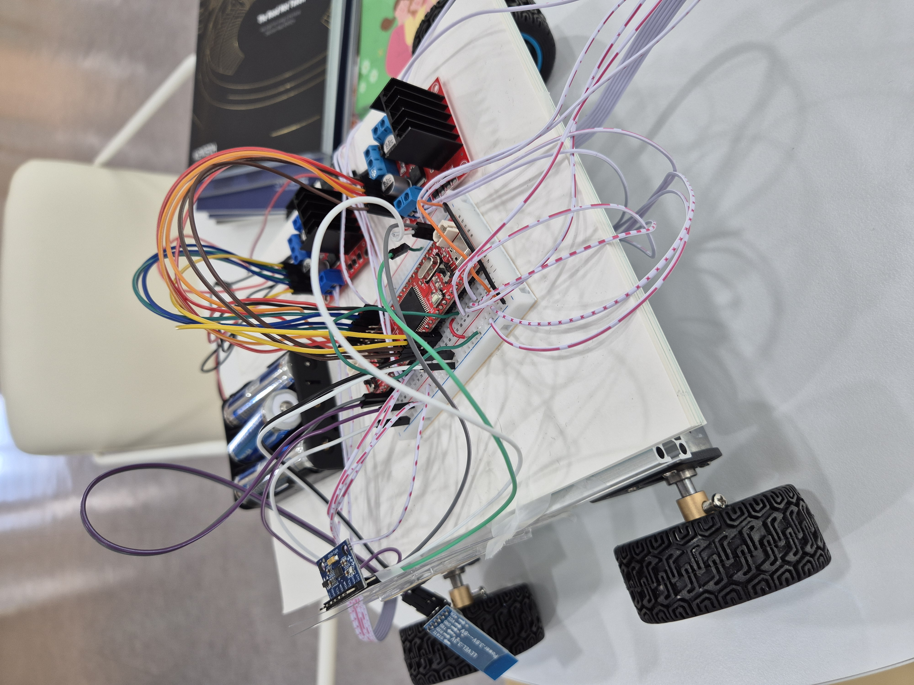
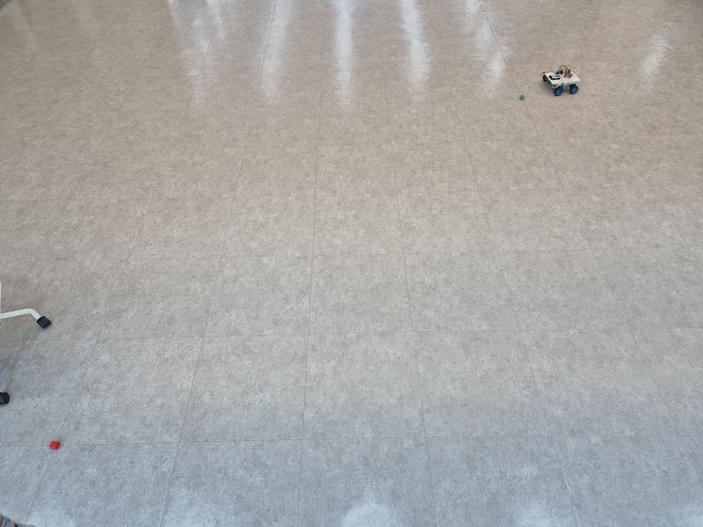
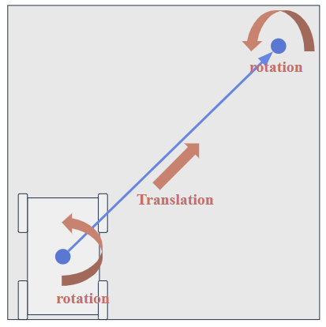

# AVR-microprocessor-and-control

### Intro

This is the first robot I have developed entirely from scratch.

### Purpose

Given a start pose and a goal pose, the robot generates a trajectory and tracks it using PD control.

### Components

- MCU: ATmega128
- 12V motor + encoder + driver
- Gyro sensor
- Bluetooth communication module

