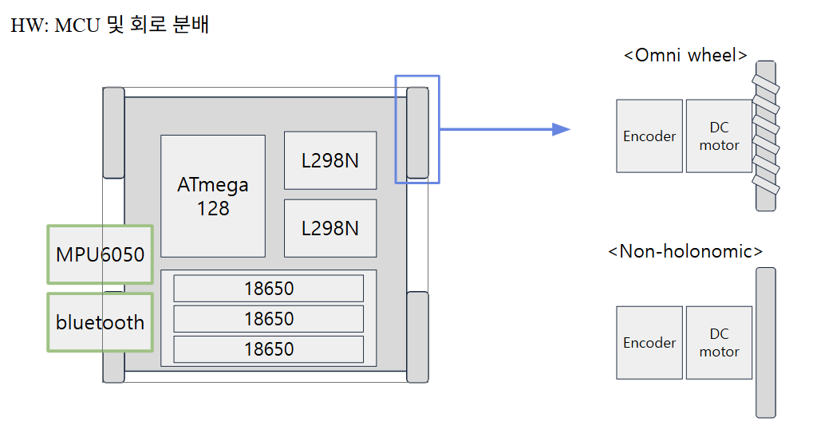

# AVR-microprocessor-and-control
### Intro
처음으로 바닥부터 직접 개발해본 로봇입니다.

### Purpose
start pose와 goal pose를 입력받으면 trajectory을 생성 후 tracking합니다. (PD control)

### 구성요소
- MCU: ATmega128
- 12V motor + encoder + driver
- gyro sensor
- bluetooth 통신 모듈

